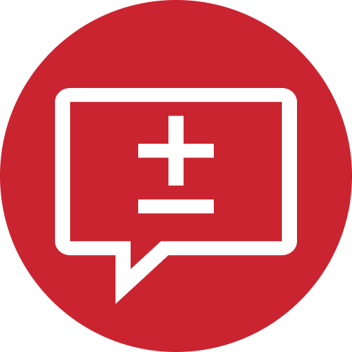
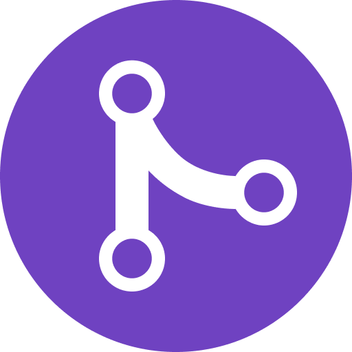
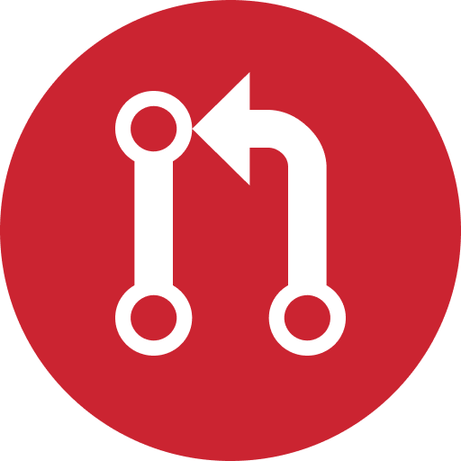
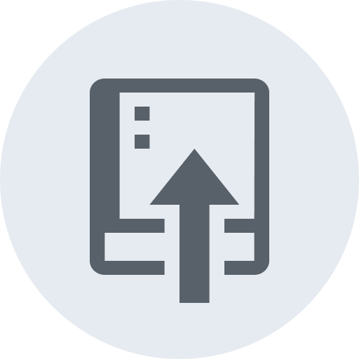
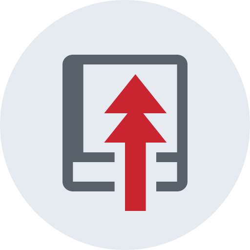

# Github emoji for Slack

A set of emoji based on Github's [Octicons](https://github.com/primer/octicons) and discussion item blocks.

Vectors are available in the [Figma file](https://www.figma.com/file/ZkJt1YyCdYfmlLF8U5JL15Jw/Slack-Github-Emoji).

### Installation

Download a `.zip` of the [latest release](https://github.com/22a/slack-github-emoji/releases) and add them to your slack workspace using [slack.com/customize/emoji](https://slack.com/customize/emoji).

### Preview

| Reviewed                       |                       |
| :----------------------------- | ----------------------------------------------------------------------------------------------------|
| **Approved**                   |                       |
| **Requested changes**          |     |
| **Dismissed**                  |                     |
| **Opened**                     |                           |
| **Merged**                     |                           |
| **Closed**                     |                           |
| **Pushed**                     |                                          |
| **Force pushed**               |                              |
| **Force pushed without lease** |  |
| **Check passed**               |                              |
| **Check failed**               |                              |
| **Pull request**               |                              |
