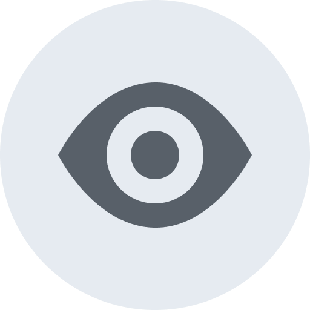

# Github emoji for Slack

A set of emoji based on Github's [Octicons](https://github.com/primer/octicons) and discussion item blocks.

Vectors are available in the [Figma file](https://www.figma.com/file/ZkJt1YyCdYfmlLF8U5JL15Jw/Slack-Github-Emoji).

### Pull Request Discussion

### Pull Request Status

### Push type

### Check status

### Misc
